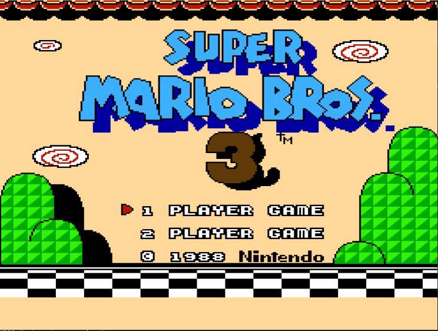
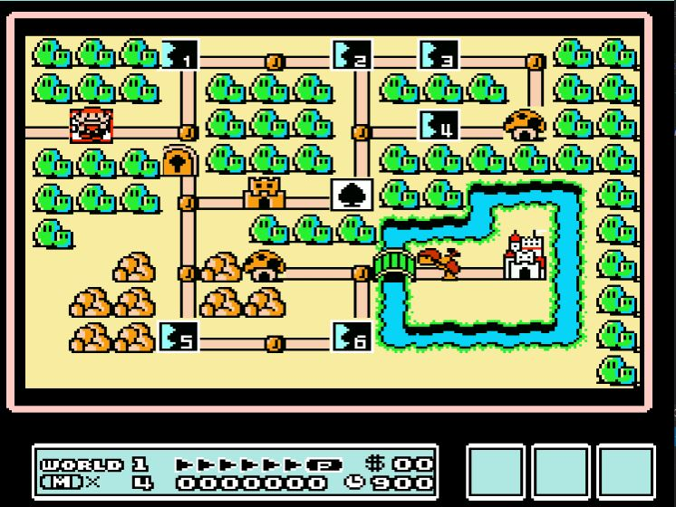
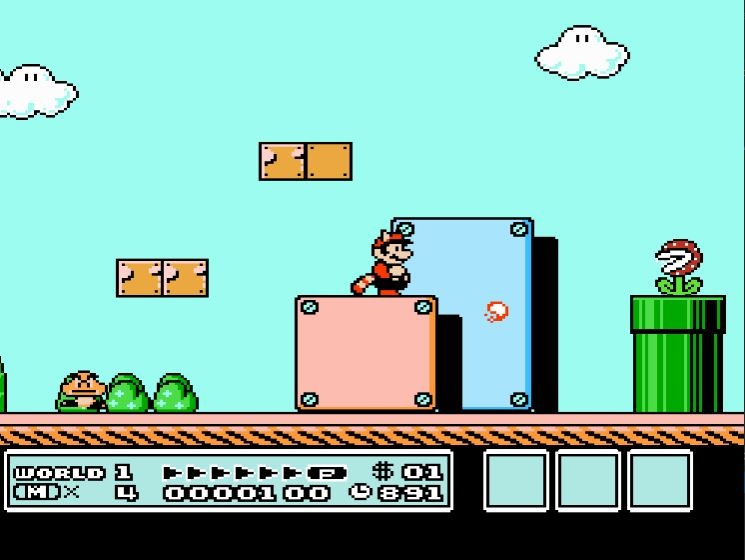
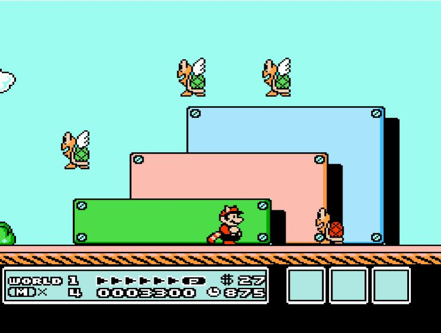
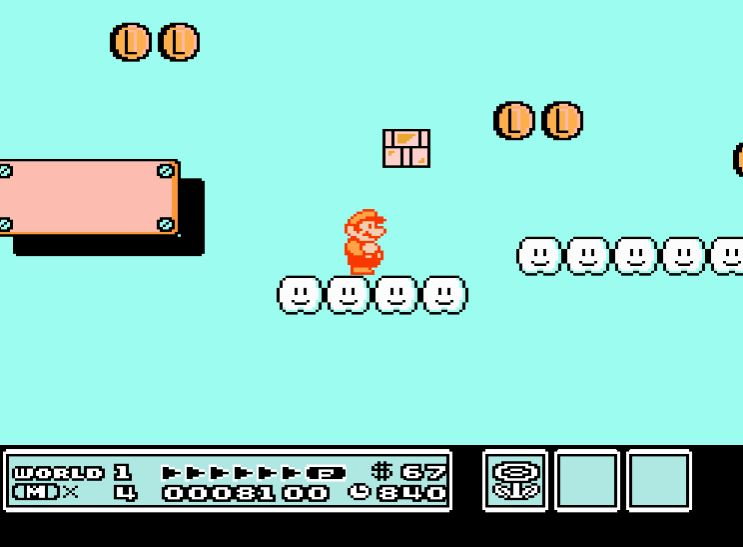
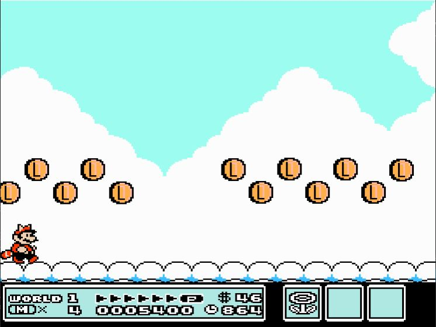
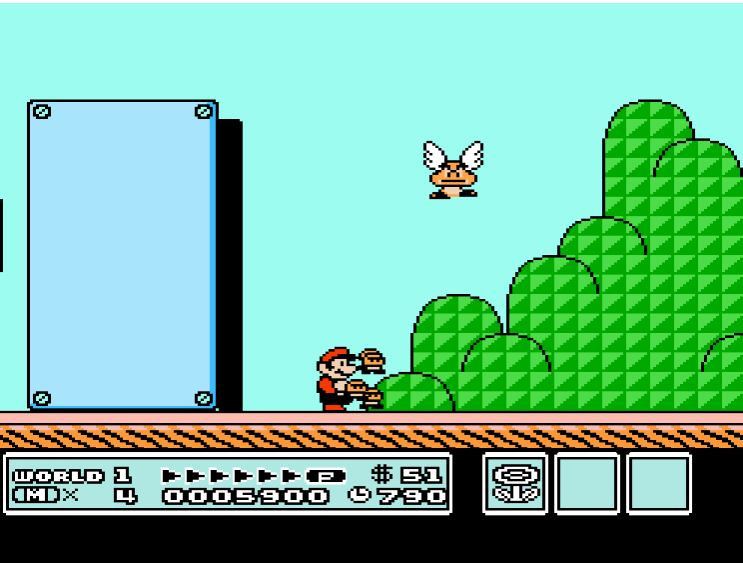
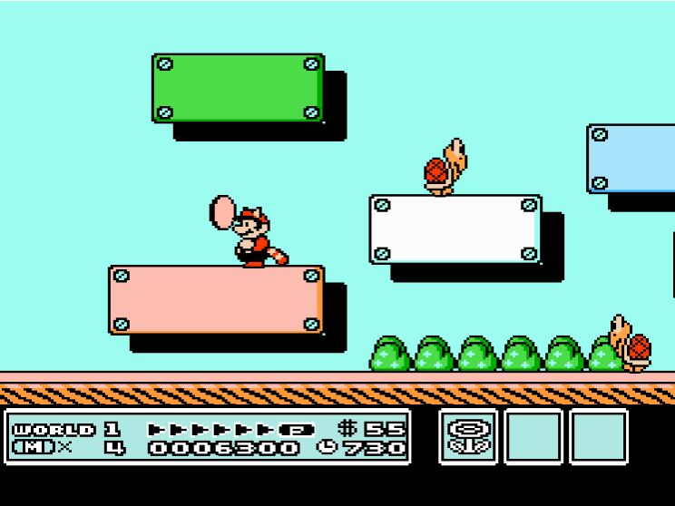
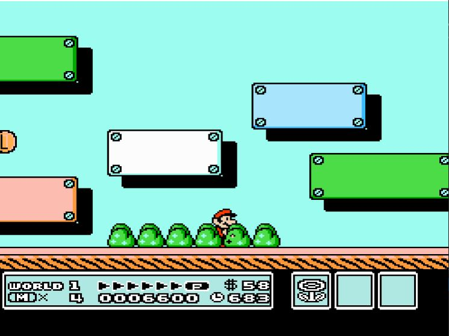
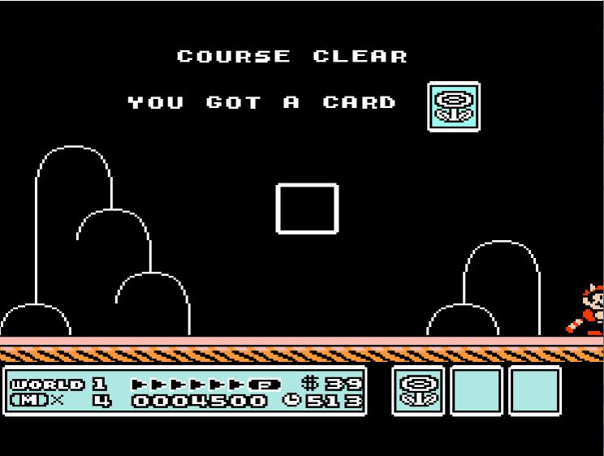

# SUPER MARIO BROS 3
> *A Memorable Project - Special thanks to my teacher and my dearest!*

This is a remake version of Super Mario Bros 3 using DirectX and C++.

## Table of Content:
* [Instruction](#instruction)
* [Screenshots](#screenshots)
* [DesignPattern](#design-pattern)
* [References](#references)

## Instruction:
Keyboard | Feature 
:---: | :--- 
<kbd>&larr;</kbd> | `Move Left`
<kbd>&rarr;</kbd> | `Move Right`
<kbd>&darr;</kbd> | `Crouch`
<kbd>A</kbd> | `Power Up/ Throw Fireball`
<kbd>S</kbd> | `Jump`

Keyboard | Level 
:---: | :--- 
<kbd>1</kbd> | `Small Mario`
<kbd>2</kbd> | `Big Mario`
<kbd>3</kbd> | `Raccoon Mario`
<kbd>4</kbd> | `Fire Mario`

## Screenshots:
**Intro:**

  

**Worldmap:**

  

**Worldmap 1-1:**

  
  

  
  

  

  

**Worldmap 1-3:**

  
  

  

  
 

 

  
  

  

  

**Course Clear:**
  

  
 

## Design Pattern:
* Singleton
* State
* Object Pool
* Grid

## References:
[Game Programming Patterns](https://gameprogrammingpatterns.com/contents.html)

